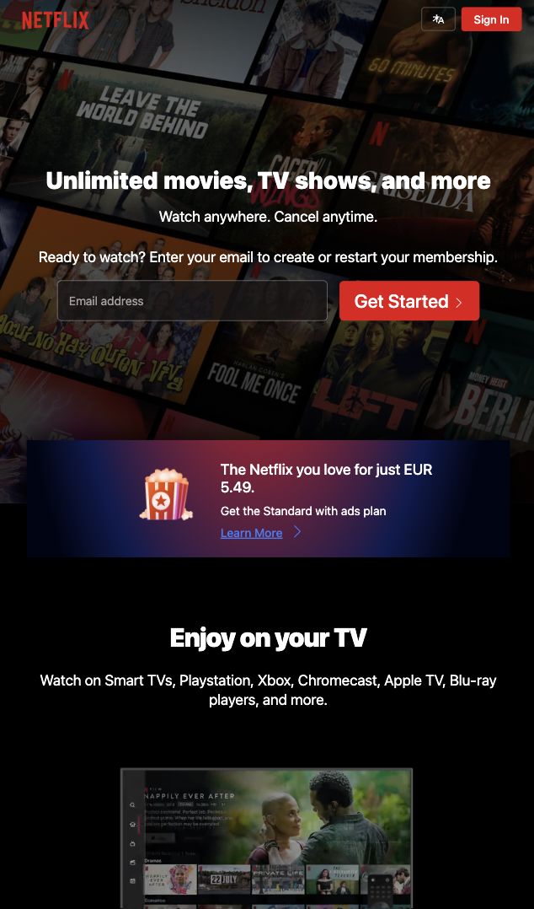
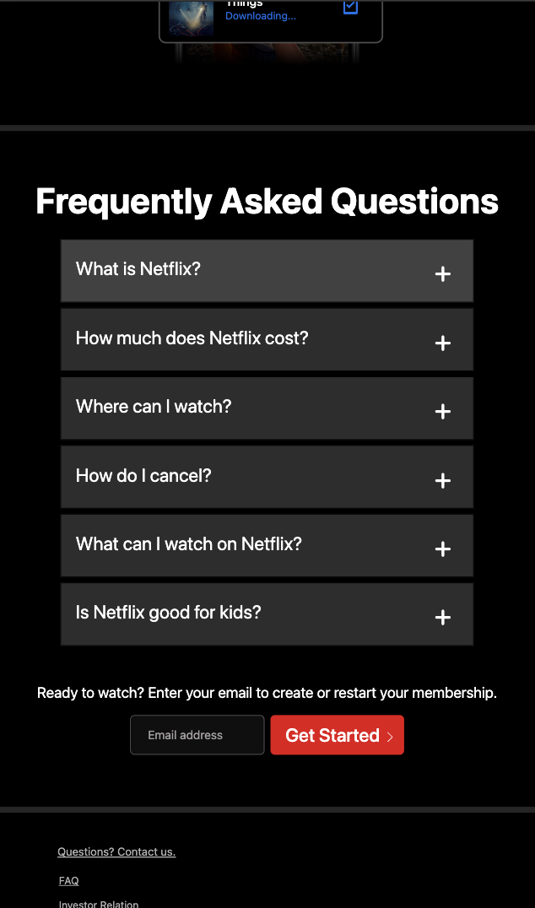

#  "Netflix" landing page

This assignment is about recreating responsive "Netflix" <a href="https://www.netflix.com/es-en/"> landing page</a> design using javascript/bootstrap/css and practising modal window (press "Sign In" button), "hamburger menu" (FAQ section).

<h4>🔹 Netflix page sample - <a href="https://simonakom.github.io/netflix-page/index.html" style="font-size:small;">View</a><h4>

### Desktop version:

### Mobile version:

